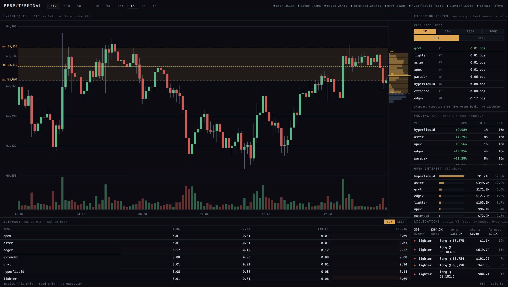

# perp-terminal



Read-only market terminal across 8 perpetual DEXes: Hyperliquid, Paradex, Lighter, Aster, Extended, EdgeX, ApeX, GRVT.

One screen: candlestick chart with market profile overlay, cross-venue funding APR with flip detection, open interest share, walked-book slippage across clip sizes, an execution router (best venue by net cost), and a live liquidation tape from the venues that expose one publicly.

Built on [perp-liquidity](https://github.com/yodablocks/perp-liquidity), which provides the 8 venue fetchers and the analyzers. This repo adds a polling service, a snapshot API, and a web UI. Public APIs only. No keys, no execution, no signals.

## Run

```
pip install .
perp-terminal --port 8010
```

Open http://127.0.0.1:8010. Options: `--token BTC --interval 5 --host 0.0.0.0`, or env vars `PT_TOKEN`, `PT_INTERVAL`, `PT_HOST`, `PT_PORT`.

The frontend has no build step. Native ES modules served straight from `web/`. Clone and run.

## Architecture

```
src/perp_terminal/
├── poller.py        # one long-lived client per venue, one market task per venue,
│                    # one WS tail task per venue that exposes liquidations
├── server.py        # FastAPI: /api/snapshot, /api/candles, /api/profile, /api/health,
│                    # background profile refresh loop, static mount
├── market_profile.py  # Hyperliquid candle fetch + TPO/value-area computation
└── serialize.py     # dataclasses -> JSON

web/
├── index.html
├── css/terminal.css
└── js/
    ├── main.js              # poll loop, token/interval tabs, venue strip,
    │                        # browser notifications for funding flips
    ├── api.js
    ├── panels/
    │   ├── chart.js         # candlestick chart + volume bars + hover tooltip (canvas)
    │   ├── profile.js       # market profile histogram (canvas)
    │   ├── funding.js       # funding APR table, scrollable
    │   ├── oi.js            # open interest bar chart
    │   ├── slippage.js      # slippage matrix
    │   ├── router.js        # execution router (best venue by net cost)
    │   └── liqtape.js       # liquidation tape
    └── lib/format.js
```

The poller holds all venue state in memory. The server reads that state and computes rankings and slippage on each `/api/snapshot` request via perp-liquidity's pure analyzer functions. Market profiles for BTC, ETH, and SOL are pre-fetched on startup and refreshed every 60s in a background task so `/api/profile` always returns from cache. The browser polls `/api/snapshot` every 3s and `/api/candles` every 15s.

## Panel notes

**Chart**: candlestick OHLCV from Hyperliquid, 120 candles at the selected interval. Volume bars rendered below the price chart. Hover for a per-candle tooltip (O/H/L/C/V, UTC timestamp). Market profile overlay (POC, VAH, VAL, value area shading) computed from the same candles.

**Funding**: APR annualised using each venue's actual period (1h / 4h / 8h). `FLIP` badge marks venues where the rate crossed zero since the last poll. Browser notifications fire on new flips (requires permission).

**OI**: USD open interest ranked by share. Bar widths normalised to the largest venue.

**Slippage / Execution router**: walks the live order book against a mid-price reference at 1k / 10k / 100k / 500k USD clips, both sides. The router picks the lowest net-cost venue for a given clip and side.

**Liquidation tape**: cross-venue stream, long/short, USD size, age. Summary bar shows total liquidated USD over the window.

Depth panel methodology and funding/slippage details live in the [perp-liquidity README](https://github.com/yodablocks/perp-liquidity).

## Coverage and honesty

Not every venue exposes everything. Liquidations are public on 3 of 8 venues (Hyperliquid, Lighter, Extended, via websocket). The other 5 are reported as not available rather than approximated. Venue status dots in the header show ok / stale / down with per-venue latency, and errors are surfaced in the API response instead of being swallowed.

## Known limitations

- Single active token at a time. Switching tokens clears state and refills within one poll cycle.
- The liquidation tape covers only the venues with public feeds. It is a sample of the market, not the whole market.
- ApeX is geo-blocked on some ISPs. perp-liquidity ships a DNS override transport that handles this automatically.
- Snapshot polling, not streaming. Phase 2 adds a book recorder and a time-series depth heatmap.

## Tests

```
pip install .[dev]
pytest
```

Tests run against deterministic fake venues implementing the same ABC as the real fetchers. No network required.
